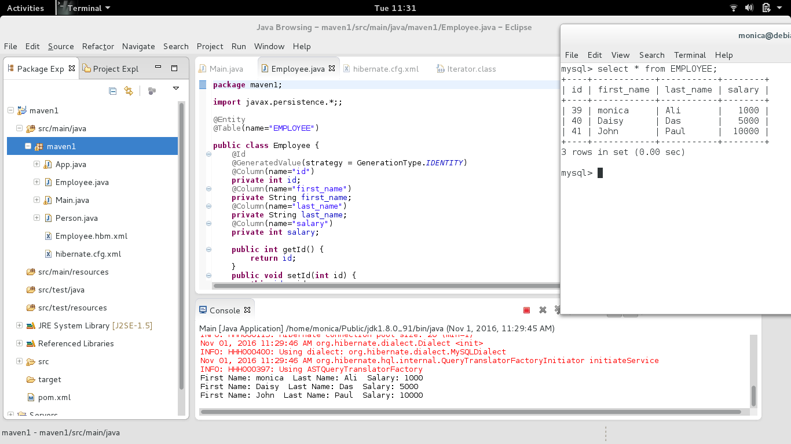
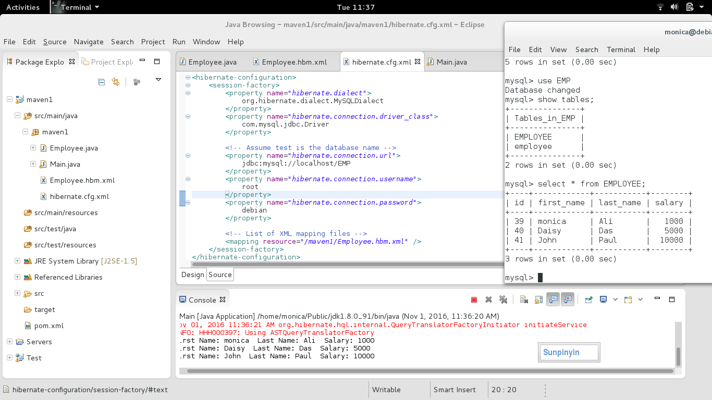

resume： 
基本信息 
       gender：     female                            birth time：1994/7            		    
       university ：chengdu neusoft                   major：the internet engineering 
       name：        Tangxiaojuan                     location：Chengdu 
       email：743322319@qq.com                        phone ：13348847681  
求职意向 
           软件相关、java实习生 、android 实习生、軟件測試、英语相关 
教育背景 
         2013/9-2017/9 	成都东软学院  网络工程  本科  
        主修课程：大学英语、大学计算机基础、php、网页设计与开发、数据结构、mysql数据库、c语言程序设计、c++、计算机网络、网络编程、linux 等 
语言情况 
CET 4、CET 6 
简介 
       对程序语言十分感兴趣,java、android 基础牢固 
       了解Rxjava、javascript、css、html 
       熟悉 linux 的常用命令(debian) 
       熟悉mysql数据库 
       能运用常用库：hibernate、 jquery，ajax，maven，gson，retrofit，picasso等 
       熟悉 android 四大组件、常用布局,熟悉 sqlite 、sharedpreference 、json 数据解析以及 listView 优化。       
       爱折腾：刚开始装系统那会儿一直瞎折腾，直到最后把所有windows版本和部分linux版本都试了个遍。 
项目经历 
    language：                java 
    operation system：        debian 
    program tool：            eclipse 
    project：                 ajax、hibernate的示範程序：https://github.com/monicaSmith/java 

    Language ：               android 
    operation system：        debian 
    program tool：            android studio 
    project ：                能实现发微博,json 解析,获取用户信息https://github.com/monicaSmith/SinaDevelopingVersion/ 
       

# java
ajax:jquery java jsp apache
maven+hibernate:one consists of Employee.hbm.xml mapping file,
                another without mapping file but has annotation

